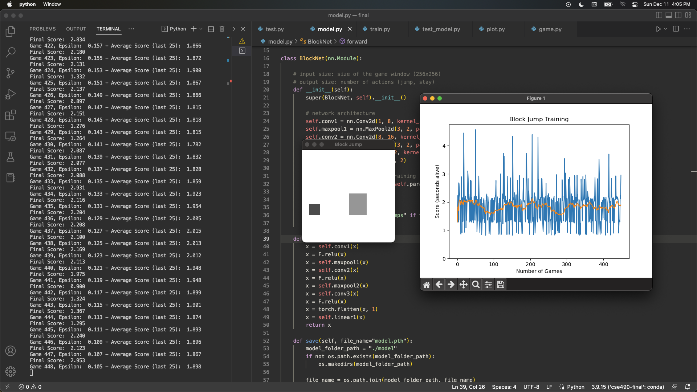
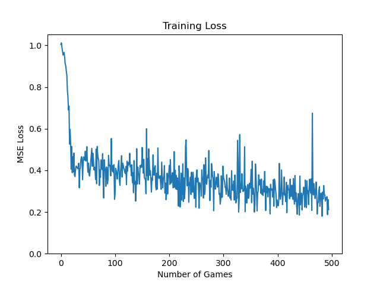
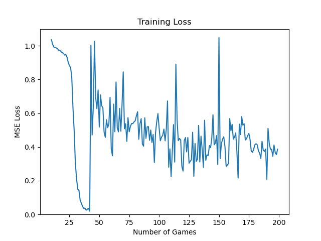
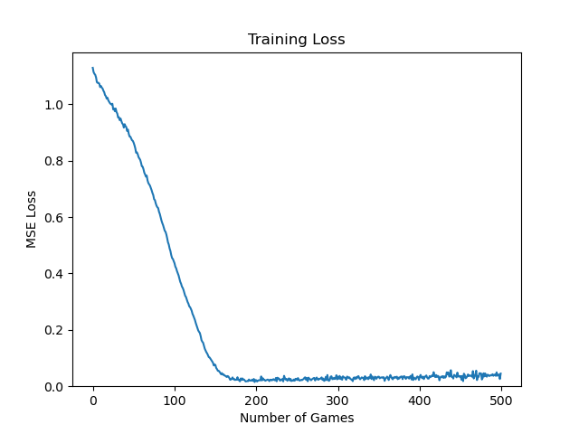

# Block Jump - Deep Q Learning
Nathan Nguyen\
CSE 490G1 - Deep Learning Autumn '22\
\
[VIDEO DEMO](TODO)

## **What is Block Jump?**

### **Block Jump — The Game —**
Block Jump is a game modeled after the [dinosaur endless-runner](https://en.wikipedia.org/wiki/Dinosaur_Game) 
that appears on Google Chrome when you don't have an internet connection. The player has two actions: 
do nothing or jump. The score is how long in seconds the player stays alive, and colliding with a randomly generated
obstacle will end the game.

### **Motivation**
Last year in a project, [BombsQQ](https://github.com/nathnguy/BombsQQ), I tried Q-learning without much 
background in artificial intelligence or deep learning. Since I'm taking both AI and deep learning
courses this quarter, I thought it would be interesting to try a similar project with more context
and ability to design my own neural network architecture.

### **Goal**
My goal in this project is to create a model that plays Block Jump close to human performance
and shows intentionality and strategy when it comes to playing the game.

## **Approach and Algorithms**

### **Neural Network Architecture**
In BombsQQ, I struggled with defining a state and reward representation that was best suited for training.
Therefore in Block Jump, I aimed to take advantage of deep learning and not worry too much about how
to represent state/reward. The game state is a 1x256x256 grayscale image of the entire window. For reward,
there is only a +1 living reward for every frame the player stays alive.

#### **BlockNet:**
- Input: Batch of 32 1x256x256 grayscale images
- 2D Convolutional Layer:
    - in channels: 1, out channels: 8
    - filter size: 3, stride: 4, padding: 1
- RELU Activation Layer
- 2D Maxpool Layer:
    - filter size: 3, stride: 2, padding: 1
- 2D Convolutional Layer:
    - in channels: 8, out channels: 16
    - filter size: 3, stride: 2, padding: 1
- RELU Activation Layer
- 2D Maxpool Layer:
    - filter size: 3, stride: 2, padding: 1
- 2D Convolutional Layer:
    - in channels: 16, out channels: 32
    - filter size: 3, stride: 2, padding: 1
- RELU Activation Layer
- Fully Connected Layer:
    - input: 512, output: 2 (representing Q-values for actions jump/stay)

#### **Hyperparameters kept constant:**
- Optimizer: Adam
- Loss Function: Mean Squared Error
- Gamma (discount factor): 0.9
- Batch size: 32
- Start - End Epsilon: 1 - 0.001

### **Algorithm**
I used two approaches to deep Q-learning: training with and without a target network. Target networks
are supposed to add stability to training and prevent Q-values from diverging, but it also strays
from pure online reinforcement learning since there is a delay to updating the Q-values. My PyTorch deep
Q-learning implementation, without a target network, was based on this video by 
[Machine Learning with Phil](https://www.youtube.com/watch?v=wc-FxNENg9U). On top of this, I added my own
neural network, target network, and game.

## **Results**
My baseline was a completely random acting agent. For 500 games, this agent averaged a score of 1.634.
To evaulate my different models, I took the average score from games played by the trained model.\
\
See the [demo](TODO) for how these models perform!

### Model 1: Targetless
- No target network
- Only trained on grounded states
    - This means that I only fed states where the agent could choose an action through the network.
    In other words, the network was fed states where the player was still airborn from a jump.
- Learning Rate: 0.001
- Number of games: 500

I got the best results with this model. For 500 games, the model had
an average score of 19.115. Some issues included specific obstacle failures and reproducibility.
Model 1 often loses for tall and thin obstacles, usually trying to jump too late. For reproducibility,
training with the same hyperparameters does not always produce the same results in testing.\
\
Thus, I tried some more training strategies, hoping to get a better performing model.

### Model 2: Trying to find the optimal jump

In this model, everything was the same as Model 1 except that I configured the game to only generate the largest obstacle.
Also I decreased the number of games to 200 since I thought that it would train faster for a decreased state space.

My idea here was that the model would be trained to always do the best jump possible. For only generating the largest
obstacle, this model performs at perfect accuracy for as long as I was able to test. However, for randomly generated
obstacles, Model 2 had an average score of 2.547 for 50 games. It surprised me that the model lost most often by jumping
too early since the large obstacles require that you jump at the latest possible moment.

### Model 3: Target Time
- Trained on all states
- Learning Rate: 0.0001
- Number of games: 500

So far, the loss during training had been erratic, so I decided to try using a target network.

The loss here looks great, but it's deceiving when it comes to in-game performance. For 50 games,
this model averaged a score of 1.797. The mean squared error is taken between the predicted Q-value
and the target Q-value, so what could be happening here is that the predicted Q-value is trying to converge
to a target Q-value that is incorrect, perhaps through overestimation. Ultimately, it was difficult to find
a combination of hyperparameters with the target net that could produce decent results.

## **Conclusion**
With this project, I wanted to see if I could feed a game window directly into a neural net, with only a living
reward, and teach a model to play the game effectively. With Model 1, I'm glad that this was possible, but there
are still improvements that could be made for making effective performance less reliant on auspicious training runs.\
Here are some extensions of Block Jump that I thought could be interesting with more time:
- Adding complexity to the game:
    - flying obstacles
    - different jump heights, ducking
    - speeding up obstacles
- Removing the need for target network with [DeepMellow](https://www.ijcai.org/proceedings/2019/0379.pdf)
- Advantage Actor Critic/Proximal Policy Optimization Algorithms

## **Dependencies**
- [Python 3.9](https://www.python.org/downloads/release/python-390/)
- [NumPy](https://numpy.org/doc/stable/index.html)
- [PyTorch](https://pytorch.org/)
- [Pygame](https://www.pygame.org/news)
- [Matplotlib](https://matplotlib.org/)
